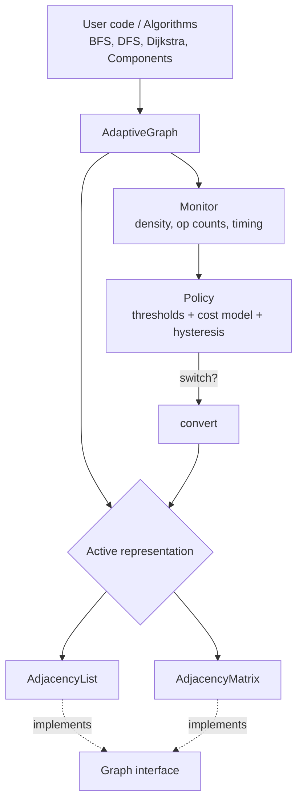

<div align="center">

# AdaptiveGraph

**Intelligent representation switching framework for dynamic networks**

*One graph API. Multiple internal representations. The right one, chosen automatically.*


</div>

---

## Table of Contents

- [Why AdaptiveGraph?](#why-adaptivegraph)
- [Key Ideas](#key-ideas)
- [Architecture](#architecture)
- [Complexity Cheat Sheet](#complexity-cheat-sheet)
- [How the Switching Works](#how-the-switching-works)
- [Project Structure](#project-structure)
- [Getting Started](#getting-started)
- [Usage](#usage)
- [Benchmarks](#benchmarks)
- [Testing](#testing)
- [Roadmap](#roadmap)
- [x] Abstract `Graph` interface and `AdjacencyList`
- [x] `AdjacencyMatrix`
- [Limitations and Honest Notes](#limitations-and-honest-notes)
- [References and Related Work](#references-and-related-work)
- [Author](#author)
- [License](#license)

---

## Why AdaptiveGraph?

No single graph representation is best for every graph or every workload.

| Representation | Strength | Weakness |
|---|---|---|
| **Adjacency Matrix** | O(1) edge lookup and update | O(V²) space, slow neighbour iteration on sparse graphs |
| **Adjacency List** | O(V + E) space, fast neighbour iteration | Edge lookup costs O(degree) |

Real networks (social, road, communication) **change over time**: they grow, shrink, and shift between read-heavy and write-heavy phases. A representation that was perfect at the start becomes wasteful later.

**AdaptiveGraph** watches its own density and operation mix, and switches representation **only when the switch is expected to pay off**.

> **Hypothesis:** across dynamic workloads, AdaptiveGraph matches or outperforms the better of the two fixed representations in total time and memory.
> This is being tested with the benchmark suite in this repo. See [Benchmarks](#benchmarks).

---

## Key Ideas

- **Unified interface:** every representation implements the same `Graph` abstract class, so algorithms never care which one is active.
- **Self-monitoring:** a monitor tracks density, operation counts (lookups vs traversals vs updates), and timing.
- **Cost-aware switching:** conversion costs O(V²), so a switch happens only when the estimated savings exceed that cost.
- **Hysteresis:** separate "switch up" and "switch down" thresholds prevent thrashing between representations.
- **Evidence over claims:** a benchmark suite compares adaptive against fixed representations on growing, shrinking, read-heavy, write-heavy and mixed workloads.

---

## Architecture



---

## Complexity Cheat Sheet

*V = vertices, E = edges, d = degree of the vertex*

| Operation | Adjacency List | Adjacency Matrix |
|---|---|---|
| Space | O(V + E) | O(V²) |
| `add_edge` | O(d) | O(1) |
| `remove_edge` | O(d) | O(1) |
| `has_edge` | O(d) | O(1) |
| `neighbors(u)` | O(d) | O(V) |
| `degree(u)` | O(1) | O(V) |
| Iterate all edges | O(V + E) | O(V²) |
| Convert to the other | O(V + E) to matrix: O(V²) | O(V²) |

*The `add_edge` cost on the list comes from the duplicate check. Any deviations from this table in the implementation will be documented.*

---

## How the Switching Works

1. **Monitor** records every operation and tracks density = `E / max possible edges`.
2. **Policy** estimates the cost of the recent workload on each representation.
3. If the other representation would have been cheaper by more than the **conversion cost**, the policy triggers a switch.
4. **Hysteresis** uses two thresholds (e.g. switch up at density 0.25, back down at 0.10) so the graph does not flip repeatedly.
5. `convert()` rebuilds the graph in the new representation and the active backend is swapped. The public API never changes.

**Planned extension:** treat switching as a *ski-rental* style online problem (switch once accumulated extra cost reaches the conversion cost), which gives a theoretical bound of about 2x the best offline choice. This will be tested empirically.

---

## Project Structure

```
AdaptiveGraph/
├── adaptivegraph/
│   ├── base.py          # abstract Graph interface
│   ├── adj_list.py      # adjacency list representation
│   ├── adj_matrix.py    # adjacency matrix representation
│   ├── monitor.py       # density + operation tracking
│   ├── policy.py        # switching rules + cost model
│   └── adaptive.py      # AdaptiveGraph (ties everything together)
├── algorithms/          # BFS, DFS, components, Dijkstra
├── benchmarks/          # workload generators + runners + results
├── tests/               # pytest suite
├── visualization/       # plots / live switching demo
├── docs/                # problem statement, report, diagrams
├── requirements.txt
└── README.md
```

*Files are added phase by phase. See the [Roadmap](#roadmap) for current progress.*

---

## Getting Started

```bash
# 1. Clone
git clone https://github.com/moonlitpayal/AdaptiveGraph.git
cd AdaptiveGraph

# 2. Create and activate a virtual environment
python -m venv venv
venv\Scripts\activate          # Windows
# source venv/bin/activate     # macOS / Linux

# 3. Install dependencies
pip install -r requirements.txt
```

---

## Usage

**Available now: adjacency list**

```python
from adaptivegraph.adj_list import AdjacencyList

g = AdjacencyList(5)            # vertices 0..4, undirected
g.add_edge(0, 1, weight=2.5)
g.add_edge(0, 2)

print(g.has_edge(1, 0))         # True
print(g.neighbors(0))           # [1, 2]
print(g.density())              # 0.2
```

**Planned API: the adaptive graph**

```python
from adaptivegraph import AdaptiveGraph

g = AdaptiveGraph(1000)
# ... add and remove edges as usual ...
print(g.active_representation)  # "list" or "matrix"
print(g.switch_history)         # when and why it switched
```

---

## Benchmarks

*Results will be added once the benchmark suite is complete.*

| Workload | Fixed List | Fixed Matrix | AdaptiveGraph |
|---|---|---|---|
| Growing (sparse → dense) | TBD | TBD | TBD |
| Shrinking (dense → sparse) | TBD | TBD | TBD |
| Read-heavy | TBD | TBD | TBD |
| Write-heavy | TBD | TBD | TBD |
| Mixed / bursty | TBD | TBD | TBD |

Each result will report average time and memory over repeated runs, plus plots showing exactly where the switches happened.

---

## Testing

```bash
pytest -v
```

A shared **contract test suite** runs the same tests against every representation, so all of them behave identically. Correctness of the algorithms will also be cross-checked against NetworkX on random graphs.

---

## Roadmap

- [x] Project setup and problem statement
- [ ] Abstract `Graph` interface and `AdjacencyList`
- [ ] `AdjacencyMatrix`
- [ ] Graph algorithms (BFS, DFS, components, Dijkstra)
- [ ] Monitor and benchmark harness
- [ ] Conversion between representations
- [ ] Switching policy with cost model and hysteresis
- [ ] Dynamic workload generators
- [ ] Full benchmark study and analysis
- [ ] Visualization of switching over time
- [ ] Final report and presentation

**Stretch goals:** CSR representation, per-vertex hybrid representation, ski-rental competitive analysis, real-world datasets (e.g. SNAP).

---

## Limitations and Honest Notes

- Written in Python, so absolute timings include interpreter overhead. Relative comparisons between representations are what matter here.
- Switching helps most when workloads actually change. For a graph with a stable profile, a fixed representation may be just as good, and the benchmarks will show where that happens.
- Adaptive representation selection is an established idea in graph and sparse-matrix systems. This project is an educational implementation with a rigorous evaluation, not a claim of a new invention.

---

## References and Related Work

- Cormen, Leiserson, Rivest, Stein, *Introduction to Algorithms* (graph representations)
- SuiteSparse:GraphBLAS (automatic sparse/dense format selection)
- Ligra, a lightweight graph processing framework (density-based traversal switching)
- Terrace, a hierarchical graph container for dynamic graphs
- Ski-rental problem and online algorithms (competitive analysis)

---

## Author

**Payal**
GitHub: [@moonlitpayal](https://github.com/moonlitpayal)

Built as a Data Structures course project.

---

## License

Released under the [MIT License](LICENSE).
